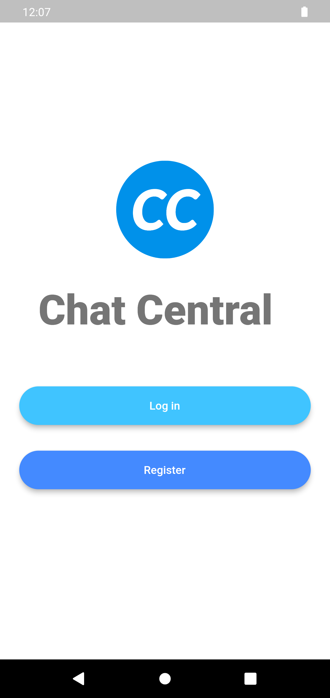
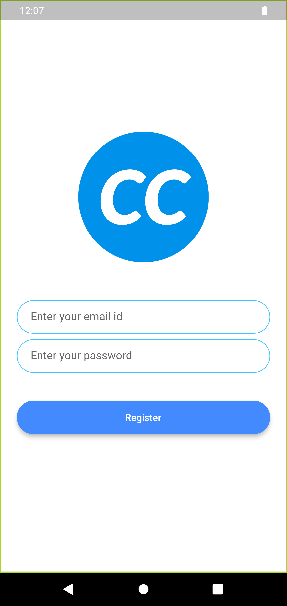
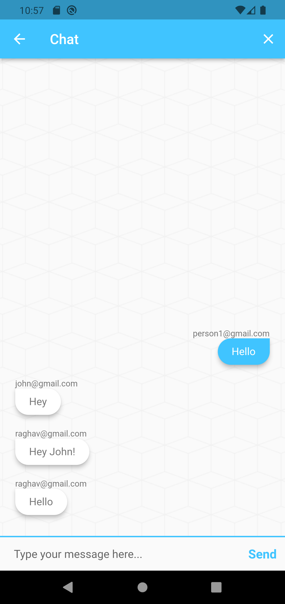

# Chat Central

A simple and easy to use cross-platform messaging app built with Flutter and Firebase. It works on Android, iOS, and Web.

## Features
- Real-time messaging with Firebase
- User authentication with Firebase Auth

## Screenshots

## How to use
1. Install the app on your device
2. Sign up for an account or log in with an existing one
3. Start messaging with friends, family

## Note
Please Note that Firebase account setup and dependency integration need to be done on the project before running the app. 

Enjoy chatting!
